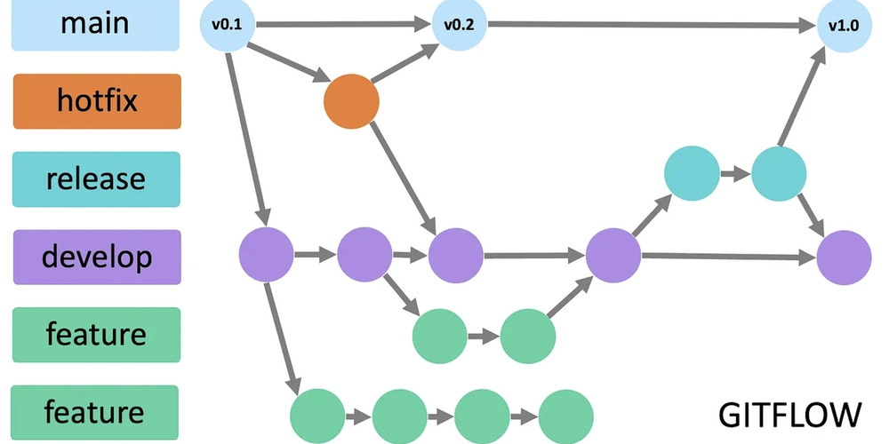

# Frontend_SIRHA_Romanos_2025-2

En este repositorio se manejara todo el Frontend del proyecto inicial "SIRHA" para la materia DOSW. Integrantes del equipo Romanos: Elizabeth Correa, Sebastian Ortega, Belen Quintero, Nicolas Martinez, Juan Pablo Contreras

# Manejo de Estrategia de versionamiento y branches


## Estrategia de Ramas (Git Flow) 



## Ramas y propósito
- Manejaremos GitFlow, el modelo de ramificación para el control de versiones de Git

### `main`
- **Propósito:** rama **estable** con la versión final (lista para demo/producción).
- **Reglas:**
  - Solo recibe merges desde `release/*` y `hotfix/*`.
  - Cada merge a `main` debe crear un **tag** SemVer (`vX.Y.Z`).
  - Rama **protegida**: PR obligatorio, 1–2 aprobaciones, checks de CI en verde.

### `develop`
- **Propósito:** integración continua de trabajo; base de nuevas funcionalidades.
- **Reglas:**
  - Recibe merges desde `feature/*` y también desde `release/*` al finalizar un release.
  - Rama **protegida** similar a `main`.

### `feature/*`
- **Propósito:** desarrollo de una funcionalidad, refactor o spike.
- **Base:** `develop`.
- **Cierre:** se fusiona a `develop` mediante **PR** 


### `release/*` 
- **Propósito:** congelar cambios para estabilizar pruebas, textos y versiones previas al deploy.
- **Base:** `develop`.
- **Cierre:** merge a `main` (crear **tag** `vX.Y.Z`) **y** merge de vuelta a `develop`.
- **Ejemplo de nombre:**  
  `release/1.3.0`

### `hotfix/*`
- **Propósito:** corregir un bug **crítico** detectado en `main`.
- **Base:** `main`.
- **Cierre:** merge a `main` (crear **tag** de **PATCH**) **y** merge a `develop` para mantener paridad.
- **Ejemplos de nombre:**  
  `hotfix/fix-blank-screen`, `hotfix/css-broken-header`


---

## Convenciones para **crear ramas**

### `feature/*`
**Formato:**
```
feature/[nombre-funcionalidad]-sirha_[codigo-jira]
```

**Ejemplos:**
- `feature/readme_sirha-34`

**Reglas de nomenclatura:**
- Usar **kebab-case** (palabras separadas por guiones)
- Máximo 50 caracteres en total
- Descripción clara y específica de la funcionalidad
- Código de Jira obligatorio para trazabilidad

### `release/*`
**Formato:**
```
release/[version]
```
**Ejemplo:** `release/1.3.0`

### `hotfix/*`
**Formato:**
```
hotfix/[descripcion-breve-del-fix]
```
**Ejemplos:**
- `hotfix/corregir-pantalla-blanca`
- `hotfix/arreglar-header-responsive`

---

## Convenciones para **crear commits**

### **Formato:**
```
[codigo-jira] [tipo]: [descripción específica de la acción]
```

### **Tipos de commit:**
- `feat`: Nueva funcionalidad
- `fix`: Corrección de errores
- `docs`: Cambios en documentación
- `style`: Cambios de formato/estilo (espacios, punto y coma, etc.)
- `refactor`: Refactorización de código sin cambios funcionales
- `test`: Agregar o modificar tests
- `chore`: Tareas de mantenimiento, configuración, dependencias

### **Ejemplos de commits específicos:**
```bash
# ✅ BUENOS EJEMPLOS
git commit -m "26-feat: agregar validación de email en formulario login"
git commit -m "24-fix: corregir error de navegación en header mobile"


# ❌ EVITAR 
git commit -m "23-feat: agregar login"
git commit -m "24-fix: arreglar bug"

```

### **Reglas para commits específicos:**
1. **Un commit = Una acción específica**: Cada commit debe representar un cambio lógico y completo
2. **Máximo 72 caracteres**: Para que sea legible en todas las herramientas Git
3. **Usar imperativo**: "agregar", "corregir", "actualizar" (no "agregado", "corrigiendo")
4. **Ser descriptivo**: Especificar QUÉ se cambió y DÓNDE
5. **Commits frecuentes**: Mejor muchos commits pequeños que pocos grandes

### **Beneficios de commits específicos:**
- 🔄 **Rollback preciso**: Poder revertir solo la parte problemática
- 🔍 **Debugging eficiente**: Identificar rápidamente cuándo se introdujo un bug
- 📖 **Historial legible**: Entender la evolución del código
- 🤝 **Colaboración mejorada**: Reviews más fáciles y claras


